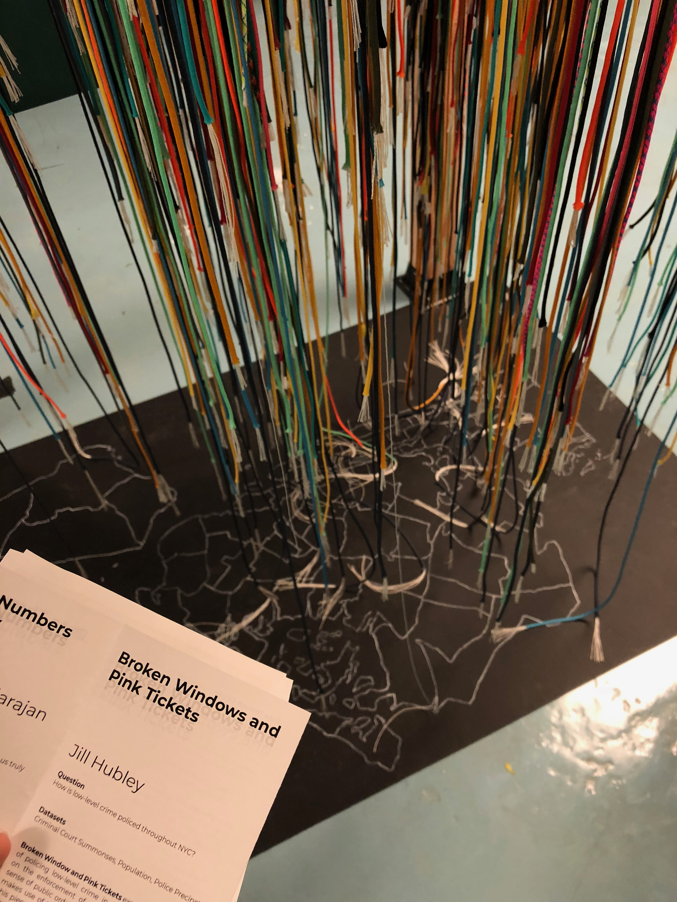
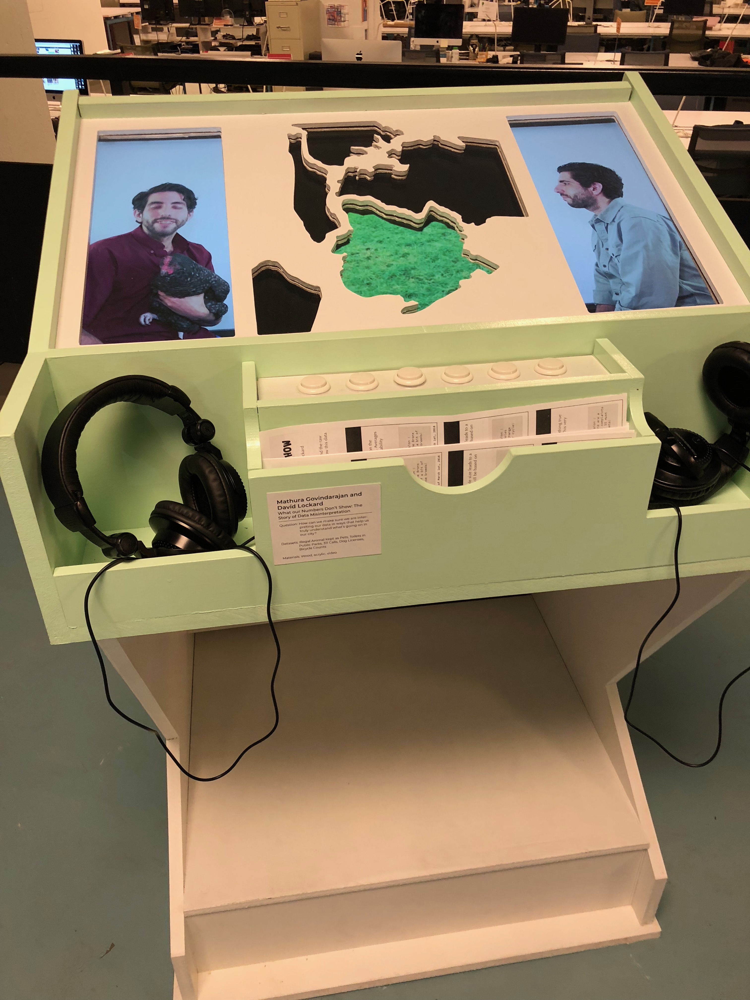

_Events I Attended for NYC Open Data Week!_  

## Wednesday, March 7: Data Through Design (Art Exhibit)  

This exhibit was hosted throughout Open Data Week, and featured works that used open data to respond to a particular question. One such question was "How is low-level crime policed throughout NYC?" An artist responded by creating a representation of an NYC maps with bunches of rope. Each color/pattern of rope represented a different low-level crime, bunched together by police precinct [pictured below].

Many of the works were straightforward portrayals of data, but one piece called _What our Numbers Don't Show: The Story of Data Misinterpretation_ stood out by breaking from this mold. This piece worked to demonstrate what misrepresentation of data looks like by extracting false-conclusions from cherry-picked bits of information. This piece was easily my favorite because it taught me the most. Even if data is well-collected, it can still be misinterpreted when we are looking to confirm some biases. It is on us to ensure that we look at as many sides of the data as possible to avoid falling into this trap.

## POSTPONED to March 28: The Missing Product Manager: Product Management in NYC Government

This event has been postponed because of Wednesday's snow storm! I have my ticket to attend the event on its new date.

---

## Contributions This Week

none!

**Contributions Total: 9**
